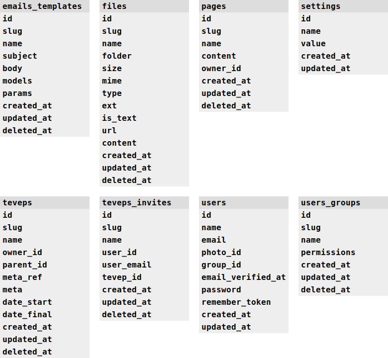

# Laravel
## Instalação
Insira os dados do banco no arquivo `.env` e então execute
os comandos abaixo, que respectivamente são para:
* Instalar dependências do laravel
* Criar tabelas, models, controllers, views e registros do banco
* Acessar pasta `/client`
* Instalar dependências javascript nesta pasta
```bash
php composer install
php artisan app:sync
cd client
npm install
```

## Desenvolvimento
O comando abaixo executa backend+frontend juntos:
```bash
npm run serve
```

## Deploy
O comando abaixo faz a build e prepara a aplicação para publicação
```bash
npm run build
```

## Migration
Criar tabelas na mão pode ser um pouco maçante, mesmo utilizando sua ferramente favorita para gerenciá-las.
Execute o comando abaixo para criar uma tabela básica, e a partir dela modelar conforme necessário:
```bash
php artisan app:table-generate
```
O comando irá lhe pedir um nome para a tabela, e a partir disso,
gerá-la com as colunas `id, slug, name, created_at, updated_at e deleted_at`.
Você pode renomear ou remover alguma dessas colunas caso necessário,
**embora seja fortemente sujerido que você as mantenha**, visto que
o sistema as usa para que você precise digitar o mínimo de código possível.

Não se esqueça de executar o comando abaixo assim que criar ou modificar uma tabela
para que o sistema gere ou customize as models, controllers e views para você
```bash
php artisan app:sync
```

## Seed
O comando criado especificamente para gerar registros básicos para o funcionamento no banco é:
```bash
php artisan app:seed
```
Entretanto, `php artisan app:install` também tem a responsabilidade sobre esse comando,
portanto você não precisa executá-lo novamente após o processo de instalação.
O usuário padrão do sistema é `root@grr.la` e sua senha é `321321`. Troque-os no primeiro acesso.
## Models
Estas são todas as models disponíveis no sistema:
```php
App\Models\EmailsTemplates;
App\Models\Files;
App\Models\Pages;
App\Models\Settings;
App\Models\User;
App\Models\UsersGroups;
```

## Customizando models
Todas as models tem essa estrutura básica
```php
<?php

namespace App\Models;

// Nomes de model são sempre gerados no plural, igual as tabelas
class Products extends \Illuminate\Database\Eloquent\Model {

   // Muitas mágicas são geradas através dessa trait
   use \App\Traits\Model;
   
   // Nomes de tabelas sempre no plural
   protected $table = 'products';
   protected $fillable = ['id', 'slug', 'name', 'price', 'created_at', 'updated_at', 'deleted_at'];

   /*
    * Esse método é sempre executado antes de salvar/exibir dados
    * para forçar que valores sigam um determinado padrão.
    * Você ainda pode utilizar mutators normalmente, esse método
    * foi criado apenas para simplificar a vida.
    */
   public function modelMutator()
   {
       $this->price = $this->price? $this->price: 0;
   }

   /*
    * A trait Model faz com que os dados sejam sempre validados antes de salvar,
    * e caso algum erro seja encontrado, uma exceção é jogada. Isso garante consistência
    * ao que entra no banco impedindo que dados inválidos passem.
    * É nesse método que definimos as regras de validação do Laravel.
    * As regras são criadas dentro de um método para que você possa criar regras
    * condicionais, caso precise por exemplo, definir uma regra específica
    * quando o $this->id conter um valor.
    */
   public function validationRules()
   {
       return [
           'name' => ['required'],
       ];
   }

   /*
    * Todas as buscas são feitas pelo método ->search() da model,
    * e para que esse método funcione bem, precisamos informar a ele
    * quais são os parâmetros padrão para uma busca. Os parâmetros informados
    * aqui serão mergeados a outros parâmetros básicos, como q, page, perpage,
    * order, orderby e outros.
    */
   public function searchParams($params=[])
   {
       return [
           'price_min' => null
           'price_max' => null
       ];
   }

   /*
    * Como já explicado, todas as buscas são feitas pelo método ->search()
    * e aqui vamos customizar a $query de busca antes que ela seja entregue
    * para o ->search() executar. Trabalhar dessa forma é interessante porque
    * você vai reaproveitar muito mais concentrando toda a lógica de busca aqui
    * em vez de ficar copiando e colando linhas e mais linhas de queryBuilder
    * todas as vezes que precisar fazer uma busca nova.
    */
   public function searchQuery($query, $params)
   {
       if ($params->price_min) {
           $query->where('price', '>=', $params->price_min);
       }

       if ($params->price_max) {
           $query->where('price', '<=', $params->price_max);
       }
   }
}
```
Essa estrutura é gerada automaticamente quando você cria uma tabela.
A array `protected $fillable` também é alterada quando você cria/remove alguma
no banco e executa `php artisan app:sync`.
Você pode criar seus métodos, casts, mutators e o que mais for necessário
para sua model aqui normalmente. A única exigência das models são:
**NÃO REMOVA A TRAIT MODEL**. Ela é responsável por muitas coisas que vão te ajudar
a ter menos dor de cabeça para desenvolver.

## Busca
Sempre que você precisar buscar dados nos bancos, é aconselhável usar o
método `->search()` da model. Porque? Porquê é mais interessante concentrar
toda a lógica de busca em um método só, em vez de ficar duplicando linhas de
queryBuilder toda vez que precisar listar itens novamente.
```php
$query = $model->search();
```
Este método retorna um queryBuilder, então você já deve ter compreendido que
com esse valor que retorna, você pode executar um `->paginate()` para obter dados
paginados, um `->get()` para recuperar todos os itens possíveis ou um `->first()`
para obter apenas o primeiro registro.
```php
$item = $model->search()->first();
$items = $model->search()->get();
$data = $model->search()->paginate(15);
```
Você também pode concatenar outros métodos, mas se você quer ter um código
reaproveitável, talvez seja melhor criar um novo parmâmetro em `searchParams`
e programar a lógica desse parâmetro em `searchQuery`.
```php
// Funciona, mas você sempre vai ter que inserir esse where 🙄
$item = $model->search()->where('status', 'public')->get();

// Programando em searchParams e searchQuery fica mais reaproveitável 😎
$item = $model->search(['status' => 'public'])->get();
```

## Controllers
Estes são todos os controllers disponíveis no sistema:
```php
App\Http\Controllers\EmailsTemplatesController;
App\Http\Controllers\FilesController;
App\Http\Controllers\PagesController;
App\Http\Controllers\SettingsController;
App\Http\Controllers\UserController;
App\Http\Controllers\UsersGroupsController;
```

## Customizando controllers
Note que o arquivo `/routes/api.php` é bem limpo: tem apenas
alguns controllers sendo instanciados e um aviso de "não edite":
```php
<?php

/*
 * NÃO EDITE ESTE ARQUIVO: Ele é gerado automaticamente
 * Para sobrescrever este arquivo execute o comando "php artisan app:sync"
 * As rotas são criadas dentro dos controllers abaixo:
 */

new \App\Http\Controllers\AppController;
new \App\Http\Controllers\AuthController;
new \App\Http\Controllers\EmailsTemplatesController;
new \App\Http\Controllers\FilesController;
new \App\Http\Controllers\PagesController;
new \App\Http\Controllers\SettingsController;
new \App\Http\Controllers\UserController;
new \App\Http\Controllers\UsersGroupsController;

```
Este arquivo é gerado sempre que você executa `php artisan app:sync`,
por isso é uma má ideia editá-lo. Isso acontece porque as rotas
são definidas no próprio controller. As funções básicas estão comentadas:
```php
<?php

namespace App\Http\Controllers;

class ProductsController extends Controller
{
	public function __construct()
	{
		/*
		 * Referência para as rotas herdadas da classe Controller saberem
		 * com qual model estão trabalhando.
		 */
		$this->model = new \App\Models\Products;

		/*
		 * Aqui está sendo declarado que todas as rotas deste controller
		 * serão protegidas pelo middleware de autenticação,
		 * exceto as rotas search e find que serão públicas.
		 */
		$this->middleware('auth:api', [
			'except' => ['search', 'find'],
		]);

		/*
		 * Este método cria rotas básicas em comum para todos os controllers,
		 * como save, search, find, delete, clone e alguns outros.
		 * Note o argumento "except": ele define quais dessas rotas
		 * não devem ser criadas. O exemplo abaixo define que este controller
		 * não terá a rota /delete.
		 */
		$this->defaultRoutes([
		    'except' => ['delete'],
		]);

		/*
		 * Aqui você pode definir rotas customizadas.
		 * As rotas sempre serão criadas tomando como base o nome do controller
		 * convertido para kebab case sem o sufixo "Controller". Ou seja:
		 * 
		 * FooController        =>  /api/foo/ 
		 * FooBarController     =>  /api/foo-bar/ 
		 * FooBarBazController  =>  /api/foo-bar-baz/ 
		 * 
		 * Conforme o exemplo dado, todas as rotas serão criadas
		 * dentro de /api/products.
		 * 
		 * parâmetro 1 = método (pode ser array ['get', 'post'] por exemplo)
		 * parâmetro 2 = rota
		 * parâmetro 3 = método do controller que será executado
		 */

		// POST: /api/products/{productId}/promo-add
		$this->route('post', '/{productId}/promo-add', 'promoAdd');

		// GET: /api/products/{productId}/promo-remove/{promoId}
		$this->route('get', '/{productId}/promo-remove/{promoId}', 'promoRemove');
	}

   public function promoAdd($productId)
   {
       return ['bla bla bla'];
   }

   public function promoRemove($productId, $promoId)
   {
       return ['bla bla bla'];
   }

}
```

## Configurações
As configurações são definidas na model \App\Models\Settings, no atributo $settingsKeys.
Lá é informado uma lista de configs que estão disponíveis para serem alteradas.

## Permissões
As permissões são definidas em `/config/permissions.php` na chave `keys`.
Nesse local você precisa informar uma lista de arrays associativas `'name' => 'Descrição'`.
Name precisa ser obrigatoriamente o name da rota no backend ou o name do componente nuxt.
O usuário então só poderar executar uma rota ou acessar uma view nuxt se aquele name estiver
na sua lista de permissões.

Todas as rotas não públicas já são protegidas pelo middleware de segurança de permissão,
então para o backend você não precisa fazer nada para que a permissão funcione.
Já no frontend você precisa informar ao nuxt que aquela pagina será protegida pelo
middleware `permission`, que é basicamente fazer como mostra abaixo:
```html
<template>
   ... content ...
</template>

<script>
export default {
   middleware: ['permission'],
}
</script>
```

## Templates de e-mail
Crie uma classe de email em `app/Mail` seguindo as outras classes como exemplo.
Ao configurar todos os atributos, execute o comando `php artisan app:sync` e deixe
que o sistema se encarregue de popular este template de e-mail novo para o banco de dados.
Após isso, tudo o que você precisa fazer é clicar em editar o template pelo admin.

## Layouts frontend
## 
## Componentes mais importantes
```html
<!-- /client/components/ui-form.vue -->

<ui-form
 method="post"
 action="/api/products/save"
 v-model="product"
 #default="form"
>
 <!--
 Este componente apenas cria uma tag form com algumas funções a mais,
 portanto é possível trabalhar normalmente como em uma tag form
 como por exemplo, criando botões type=submit para envio do formulário
 e disparár o envio clicando enter em uma input.
 
 Parâmetros:
     method: get, post, etc... assim como no axios
     action: url do endpoint
     v-model: objeto que será enviado via post
     #default="form" variavel "form" com alguns dados internos do form como:
     form.loading: true ou false, informa se o form está em processamento
     form.response: dados da resposta, request.data do axios.
     form.error: mensagem de erro do form, em string
     form.errorFields: objeto javascript com erros de validação, no formato {campo:["erro1", "erro2"]}
     form.submit: método submit() para envio do formulário
-->
</ui-form>
```

```html
<!-- /client/components/ui/model/edit.vue -->

<ui-model-edit
 model-name="products"
 model-id="153"
 singular="Produto"
 plural="Produtos"
 #default="form"
>
 <!--
 Este componente cria toda a interface básica para edição de dados,
 fazendo toda a parte repetitiva e deixando para você apenas a tarefa
 de informar quais os parâmetros básicos e como será o html dos campos.
 
 Parâmetros:
     model-name: Nome da model/table no formato kebab
     model-id: ID do registro (o sistema faz a requisição automaticamente para /products/find/153 e te retorna o objeto)
     singular: Nome no singular para descrições
     plural: Nome no plural para descrições
     #default="form" variavel "form" com alguns dados internos do form como:
     form.value: dados da model que serão editados/enviados via post
     form.loading: true ou false, informa se o form está em processamento
     form.error: mensagem de erro do form, em string
     form.errorFields: objeto javascript com erros de validação, no formato {campo:["erro1", "erro2"]}
-->

 <!-- Insira os campos normalmente -->
 <ui-field label="Nome" :error="form.errorFields.owner">
     <input type="text" class="form-control" value="form.value.name" />
 </ui-field>

 <!-- Os botões na parte de baixo do formulário serão inseridos automaticamente, -->
 <!-- mas se você precisar customizar alguma ação, utilize esse slot: -->
 <slot name="actions">
     <button type="button" class="btn btn-success">
         Ação customizada 1
     </button>

     <button type="button" class="btn btn-success">
         Ação customizada 2
     </button>
 </slot>
</ui-model-edit>
```

```html
<!-- /client/components/ui/model/search.vue -->

<ui-model-search
>
</ui-model-search>
```

```html
<!-- /client/components/ui/model/select.vue -->

<ui-model-select
>
</ui-model-select>
```

## Estrutura do banco


## Endpoints
Todas as rotas disponíveis:
<table><tbody><tr><td>Nº</td><td>Methods</td><td>Route</td><td>Name</td><td>Public</td></tr><tr><td>0</td><td>get</td><td>/api/emails-templates/search</td><td>emails-templates-search</td><td></td></tr><tr><td>1</td><td>get</td><td>/api/emails-templates/find/{id}</td><td>emails-templates-find</td><td></td></tr><tr><td>2</td><td>post</td><td>/api/emails-templates/save</td><td>emails-templates-save</td><td></td></tr><tr><td>3</td><td>get</td><td>/api/emails-templates/export</td><td>emails-templates-export</td><td></td></tr><tr><td>4</td><td>post</td><td>/api/emails-templates/test</td><td>emails-templates-test</td><td></td></tr><tr><td>0</td><td>get</td><td>/api/files/search</td><td>files-search</td><td></td></tr><tr><td>1</td><td>get</td><td>/api/files/find/{id}</td><td>files-find</td><td></td></tr><tr><td>2</td><td>post</td><td>/api/files/save</td><td>files-save</td><td></td></tr><tr><td>3</td><td>post</td><td>/api/files/delete</td><td>files-delete</td><td></td></tr><tr><td>4</td><td>post</td><td>/api/files/restore</td><td>files-restore</td><td></td></tr><tr><td>5</td><td>get</td><td>/api/files/clone/{id}</td><td>files-clone</td><td></td></tr><tr><td>6</td><td>get</td><td>/api/files/export</td><td>files-export</td><td></td></tr><tr><td>7</td><td>get</td><td>/api/files/view/{slug}.{ext}</td><td>files-view</td><td>ok</td></tr><tr><td>0</td><td>get</td><td>/api/pages/search</td><td>pages-search</td><td>ok</td></tr><tr><td>1</td><td>get</td><td>/api/pages/find/{id}</td><td>pages-find</td><td>ok</td></tr><tr><td>2</td><td>post</td><td>/api/pages/save</td><td>pages-save</td><td></td></tr><tr><td>3</td><td>post</td><td>/api/pages/delete</td><td>pages-delete</td><td></td></tr><tr><td>4</td><td>post</td><td>/api/pages/restore</td><td>pages-restore</td><td></td></tr><tr><td>5</td><td>get</td><td>/api/pages/clone/{id}</td><td>pages-clone</td><td></td></tr><tr><td>6</td><td>get</td><td>/api/pages/export</td><td>pages-export</td><td></td></tr><tr><td>0</td><td>get</td><td>/api/settings/export</td><td>settings-export</td><td></td></tr><tr><td>1</td><td>post</td><td>/api/settings/save</td><td>settings-save-all</td><td></td></tr><tr><td>2</td><td>get</td><td>/api/settings/all</td><td>settings-get-all</td><td></td></tr><tr><td>0</td><td>get</td><td>/api/user/search</td><td>user-search</td><td>ok</td></tr><tr><td>1</td><td>get</td><td>/api/user/find/{id}</td><td>user-find</td><td>ok</td></tr><tr><td>2</td><td>post</td><td>/api/user/save</td><td>user-save</td><td></td></tr><tr><td>3</td><td>get</td><td>/api/user/export</td><td>user-export</td><td></td></tr><tr><td>0</td><td>get</td><td>/api/users-groups/search</td><td>users-groups-search</td><td>ok</td></tr><tr><td>1</td><td>get</td><td>/api/users-groups/find/{id}</td><td>users-groups-find</td><td>ok</td></tr><tr><td>2</td><td>post</td><td>/api/users-groups/save</td><td>users-groups-save</td><td></td></tr><tr><td>3</td><td>post</td><td>/api/users-groups/delete</td><td>users-groups-delete</td><td></td></tr><tr><td>4</td><td>post</td><td>/api/users-groups/restore</td><td>users-groups-restore</td><td></td></tr><tr><td>5</td><td>get</td><td>/api/users-groups/clone/{id}</td><td>users-groups-clone</td><td></td></tr><tr><td>6</td><td>get</td><td>/api/users-groups/export</td><td>users-groups-export</td><td></td></tr><tr><td>7</td><td>get</td><td>/api/users-groups/permissions</td><td>users-groups-permissions</td><td></td></tr></tbody></table>
